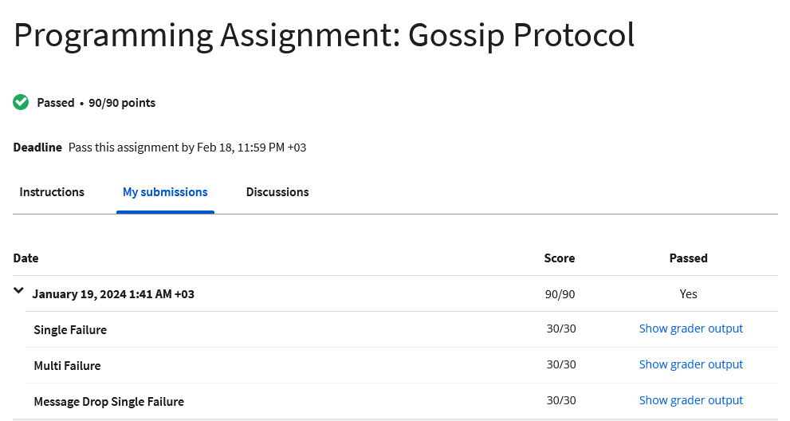
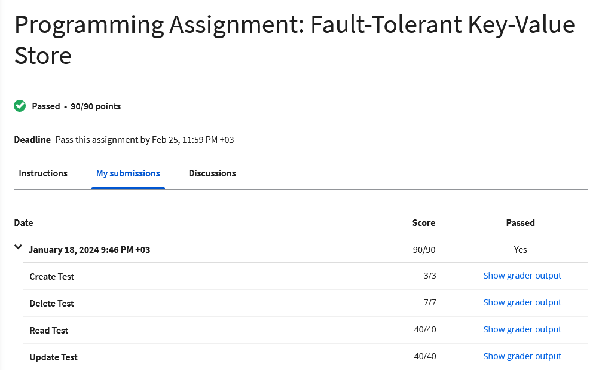

<div align="center"><div>

###  Coursera Cloud Computing Concepts, Part 1 
### MAP1_assignment
### Passed  •  90/90 points
<div align="center">

  <div>
<br>
#
<br>
###  Coursera Cloud Computing Concepts, Part 2 
### MAP2_assignment
### Passed  •  90/90 points
<br>
<div align="center">

<div>
<br>

#

### Submit Your Program for Grading:

```bat

$ Python submit.py

```
<br>
#
<br>
